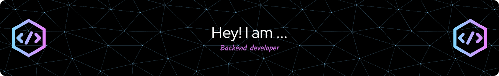

# Hi 👋 My name is David

I'm a software developer focused on web development with PHP using the Laravel Framework. Enthusiastic about clean code and good practices.

*   🚀 I'm currently working on [Phetit: a small collection of PHP packages](http://github.com/phetit/)
*   🧠 I'm currently learning Vue/Nuxt, Golang, and game development with Godot
*   🤝 I'm open to collaborating on PHP packages or some web development
*   ⚡ I like reading books, watching anime, listening to music and playing video games
*   📫 You can contact me at [lombervid@proton.me](mailto:lombervid@proton.me)
*   🌍 I'm based in Mexico

### Languages & tools

### Socials

### My Stats

&nbsp;

### Projects

&nbsp;

&nbsp;

